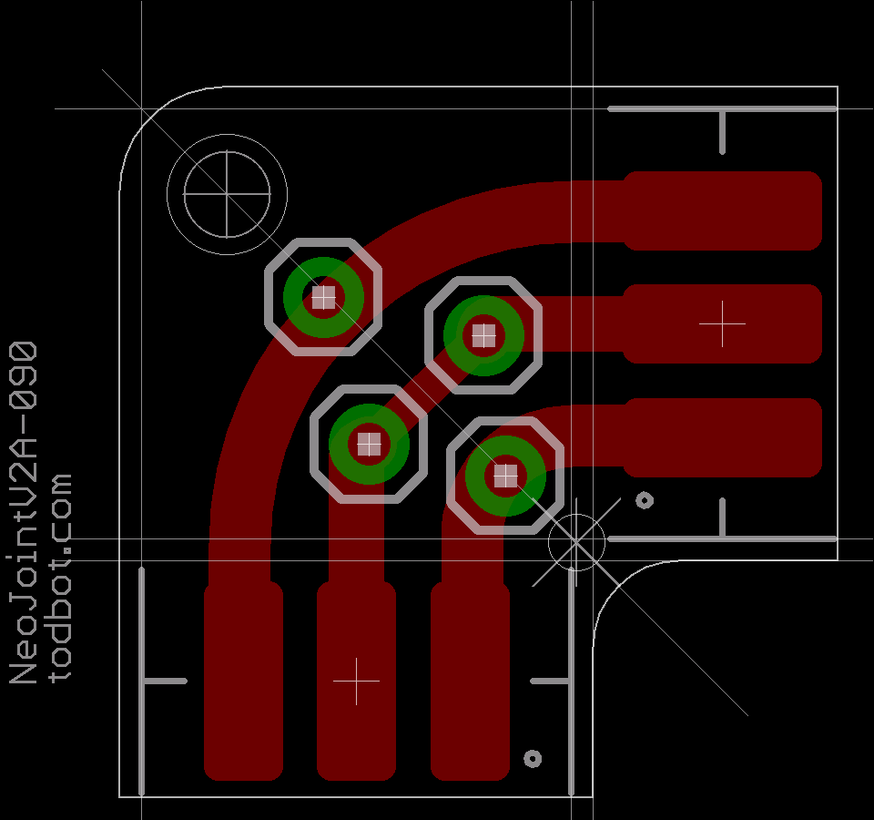
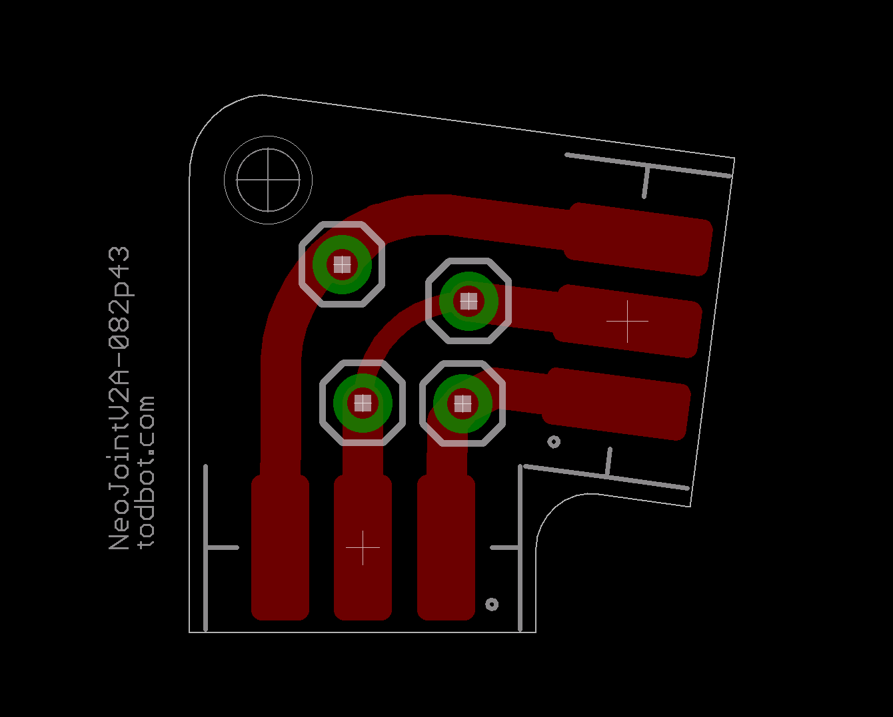
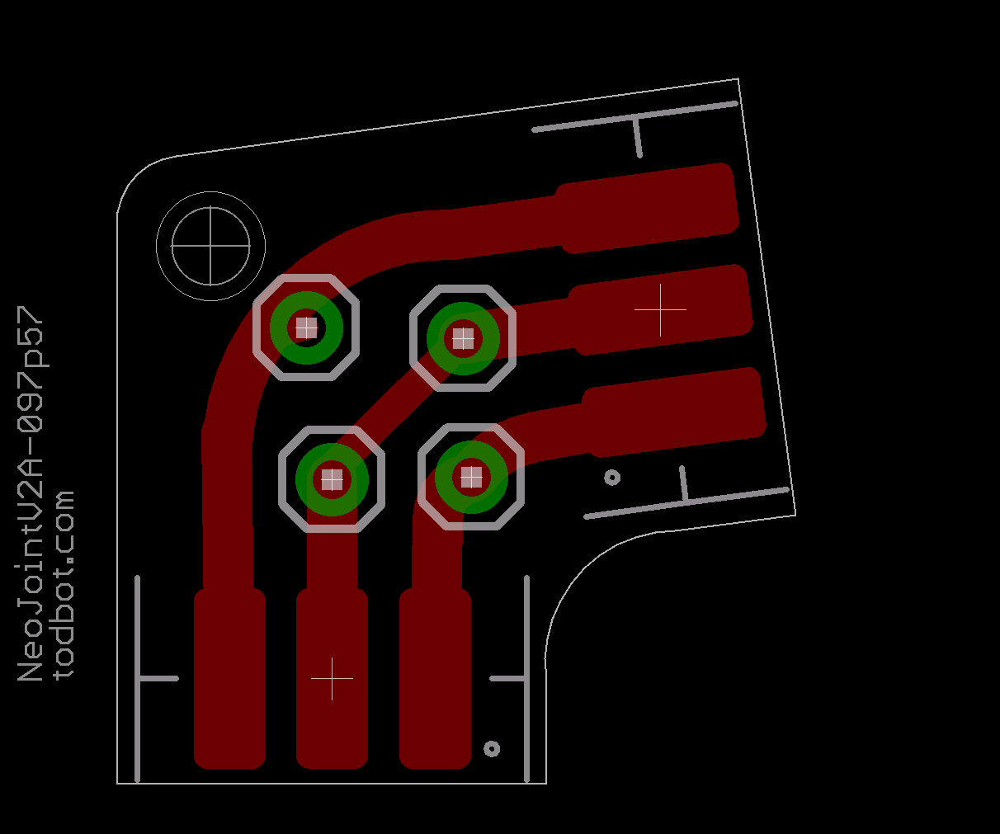
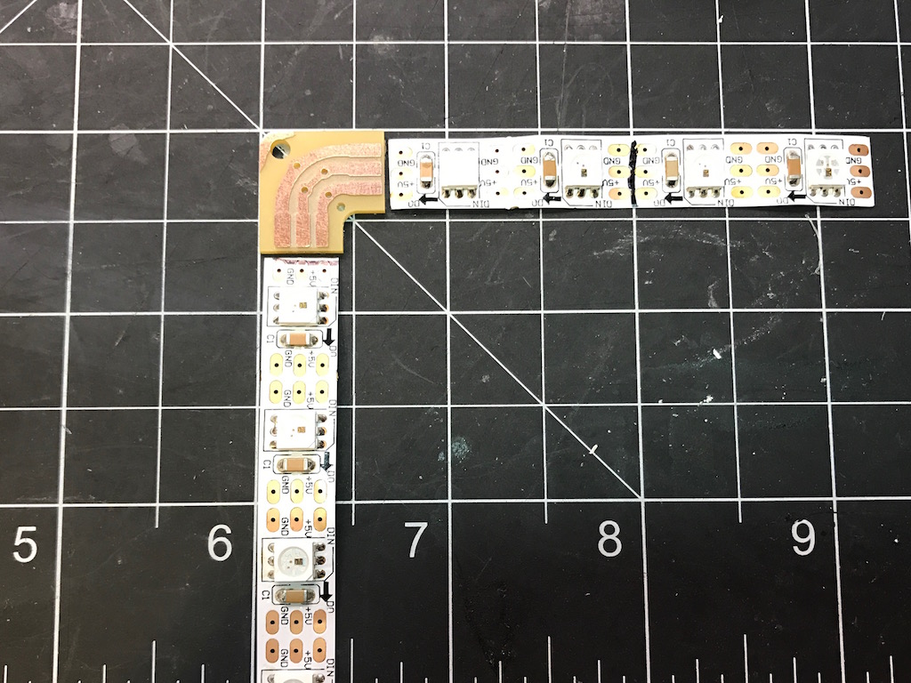
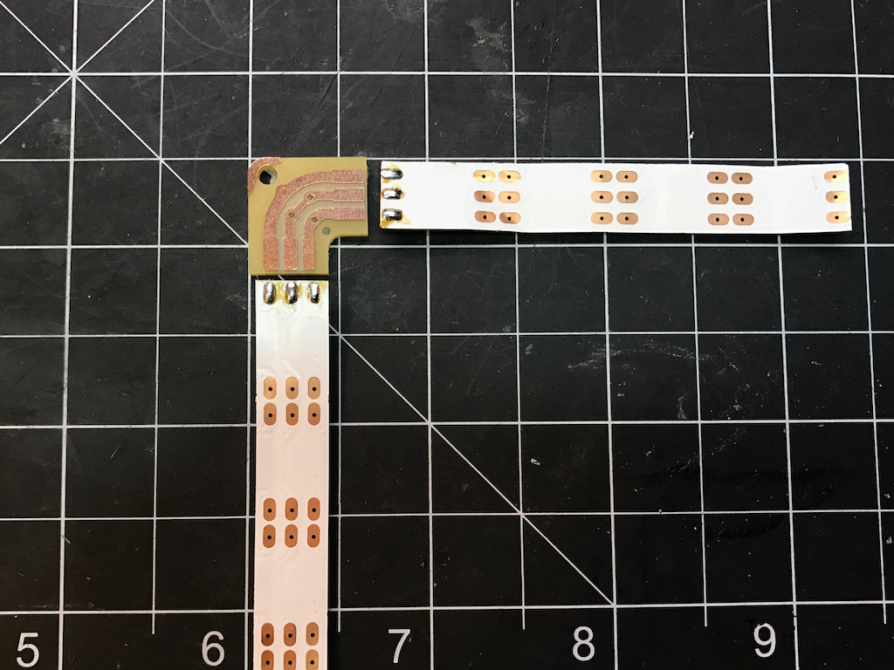
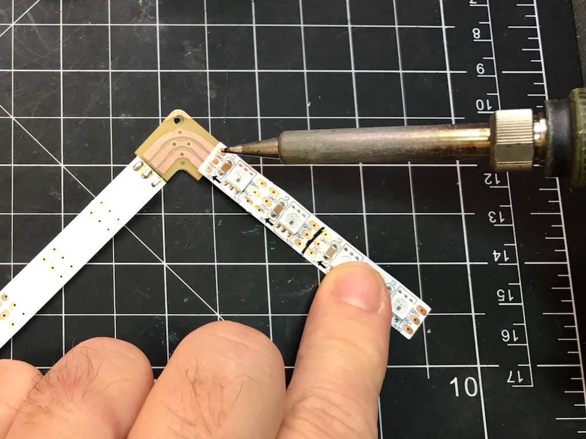
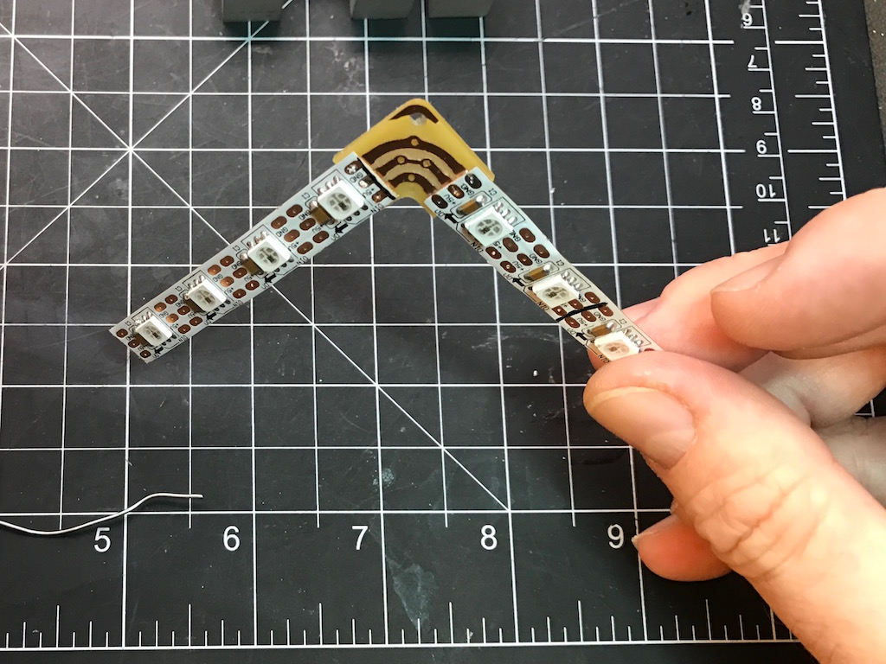

# NeoJoints
Neopixel Joints, millable on the Othermill

Table of Contents
=================

  * [What are these?](#what-are-these)
  * [Available NeoJoints](#available-neojoints)
  * [How to Solder](#how-to-solder)

## What are these?
NeoJoints make it easy to solder together pieces of WS2812 / NeoPixel-style
LED strip.

NeoJoints have the following features
* Available in multiple angles
* Solderable holes for adding additional power at joints
* Cuttable trace on data line for separating strips logically
* Mounting hole for 2-56 screw
* Single-sided millable on PCB mill like Othermill,
    with a single 1/32" endmill (though adding 1/8" to cleanup helps)

Originally from 5 Jun 2015 task for "Mill-a-Week": https://github.com/todbot/Mill-a-Week

## Available NeoJoints

* **NeoJointV2-090**
    - 90-degree right angle

    

* **NeoJointV2-000**
    - 0-degree straight joint

    

* **NeoJointV2-082p43**
    - 82.43-degree right angle, for inner angle of segment display

    

* **NeoJointV2-097p57**
    - 97.57-degree right angle, for outer angle of segment display

    

* more coming...

## How to Solder

* Step 1: Get NeoJoint and LED strip pieces laid out correctly
  - Be sure to make sure data arrows are pointing correctly

  

* Step 2: Turn over strips, put small solder blobs on *back* of each pad
  - Depending on the strip, you may need to scratch away adhesive layer or waterproofing

  

* Step 3: Lay strip on top of NeoJoint, then heat up with soldering iron to melt solder blobs, one by one
  - Take care to keep strip aligned when melting first solder blob

  

* Step 4: Continue until you've soldered down all points
  - You can look along the side of the strip to see if the solder has melted
  - And you can see if you have any solder bridges

  
